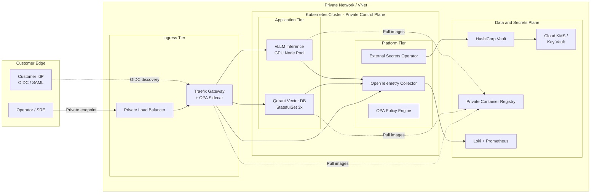

# llm-onprem-deployment-kit

> An opinionated, enterprise-grade deployment kit for running LLM applications in private, hybrid, or airgapped cloud environments. Bring-your-own-infrastructure, BYO-model, security-and-compliance by default.

[](https://github.com/KIM3310/llm-onprem-deployment-kit/actions/workflows/terraform-validate.yml)
[](https://github.com/KIM3310/llm-onprem-deployment-kit/actions/workflows/helm-lint.yml)
[](https://github.com/KIM3310/llm-onprem-deployment-kit/actions/workflows/shellcheck.yml)
[](./LICENSE)
[](https://www.terraform.io/)
[](https://kubernetes.io/)
[](https://helm.sh/)

---

## Table of Contents

1. [Why this exists](#why-this-exists)
2. [What you get](#what-you-get)
3. [Reference Architecture](#reference-architecture)
4. [Quick Start](#quick-start)
5. [Compliance Mappings](#compliance-mappings)
6. [Runbooks](#runbooks)
7. [Choosing a Cloud](#choosing-a-cloud)
8. [Security Model](#security-model)
9. [Extending](#extending)
10. [Related Projects](#related-projects)
11. [License](#license)

---

## Why this exists

Shipping large language model (LLM) applications to regulated customers is not a model problem. It is an *infrastructure* problem.

By the time a customer has decided to buy, their deployment team is asking questions that have little to do with tokens per second:

- "Can we run this inside our existing VNet with no egress to the public internet?"
- "Where does the encryption key live and who rotates it?"
- "How do we mirror the container images into our private registry?"
- "What does your disaster recovery look like, and can you show us an actual runbook?"
- "Does this map to our SOC 2 and ISO 27001 controls?"

`llm-onprem-deployment-kit` is the opinionated answer. It packages the infrastructure-as-code, Helm charts, runbooks, and compliance artifacts required to take an LLM application from a signed contract to a running, auditable production system inside a customer's environment.

**Target audience:**

- Enterprise infrastructure teams responsible for deploying third-party AI workloads in regulated environments (financial services, healthcare, public sector, defense, energy).
- Forward deployed engineering teams at AI-native vendors who need a consistent deployment story across dozens of customer environments.
- Security and compliance reviewers who need to map a proposed deployment to existing control frameworks before granting change-management approval.

If the question is "how fast can I get a demo LLM running on my laptop," this is not the right repository. If the question is "how do I ship an LLM workload to a customer's airgapped VNet and get through their security review without eight weeks of back-and-forth," this is.

---

## What you get

- **Terraform across three clouds** - Production-quality modules for Azure AKS, AWS EKS, and GCP GKE with private-only control planes, GPU node pools, private endpoints, and customer-managed KMS integration.
- **A single unified Helm chart** - `llm-stack` deploys the full application: vLLM inference, Qdrant vector database, Traefik gateway, OPA policy sidecar, OpenTelemetry collector, and External Secrets Operator wiring. One chart. Two values files (`values.yaml`, `values-airgap.yaml`).
- **Airgap runbooks and tooling** - `scripts/airgap-mirror.sh` enumerates every container image the kit ships with their pinned digests and mirrors them into a customer-controlled registry. A step-by-step runbook walks through the procedure.
- **Compliance mappings** - Explicit control-by-control mapping for SOC 2 Type II and ISO 27001:2022 Annex A, plus an "airgap requirements" summary that most procurement teams can consume directly.
- **Incident response playbook** - Severity levels, paging thresholds, customer handoff pattern, and a diagnostic-bundle collection script that produces the artifacts support actually needs.
- **Architecture Decision Records** - Documented rationale for every load-bearing choice (vLLM vs TGI, Qdrant vs Weaviate, K8s vs ECS, secrets model, airgap image strategy), so downstream teams can challenge or extend decisions without reverse-engineering them.
- **Minimal surface area for CI** - Three GitHub Actions workflows (`terraform-validate`, `helm-lint`, `shellcheck`) that make `main` provably green.

---

## Reference Architecture



Notable properties of this architecture:

- **No public endpoints.** The API server has a private-only control plane; the load balancer is internal; the container registry is private; the secret store is in-VNet.
- **Customer-managed keys (CMK).** KMS / Key Vault / Cloud KMS holds the keys; the operator rotates, the vendor cannot exfiltrate.
- **Policy at the gateway.** OPA sidecars enforce per-route authorization and can be updated without rebuilding the inference image.
- **Single observability pipeline.** Every hop emits OpenTelemetry; the collector is the only component the customer has to whitelist.

For the long form, see [`docs/architecture.md`](./docs/architecture.md).

---

## Quick Start

The quick start assumes (a) a workstation with `terraform`, `helm`, `kubectl`, and the cloud CLI of your choice; (b) permissions to create a VPC/VNet, a Kubernetes cluster, and a KMS key in the target subscription/account/project; and (c) a private container registry that the cluster can pull from.

For a full airgapped install with image mirroring, see [`docs/runbooks/initial-deploy.md`](./docs/runbooks/initial-deploy.md).

### 1. Pick a cloud and provision infrastructure

```bash
# Azure example
cd terraform/modules/azure-aks/examples/basic
terraform init
terraform plan  -out=tfplan -var-file=../../../../../examples/quickstart-azure/terraform.tfvars
terraform apply tfplan
```

Equivalent commands exist under `terraform/modules/aws-eks/examples/basic` and `terraform/modules/gcp-gke/examples/basic`.

### 2. Mirror container images (airgapped environments only)

```bash
export TARGET_REGISTRY=registry.customer.internal/llm-stack
scripts/airgap-mirror.sh --target "$TARGET_REGISTRY" --dry-run
scripts/airgap-mirror.sh --target "$TARGET_REGISTRY"
```

### 3. Install the llm-stack Helm chart

```bash
helm upgrade --install llm-stack ./helm/llm-stack \
  --namespace llm-stack --create-namespace \
  --values ./helm/llm-stack/values.yaml \
  --values ./helm/llm-stack/values-airgap.yaml \
  --atomic --timeout 10m
```

### 4. Verify

```bash
make status
scripts/smoke-test.sh --namespace llm-stack --release llm-stack
```

The smoke test hits the Traefik gateway, asserts that OPA is enforcing auth, sends one inference request end-to-end, and upserts a sample embedding into Qdrant.

---

## Compliance Mappings

This kit is designed to produce evidence that maps directly to common enterprise control frameworks. Full mappings live under [`docs/compliance/`](./docs/compliance/).

| Framework | Scope | Mapping Document |
|-----------|-------|------------------|
| SOC 2 Type II | Trust Services Criteria (Security, Availability, Confidentiality) | [`soc2-type2-mapping.md`](./docs/compliance/soc2-type2-mapping.md) |
| ISO 27001:2022 | Annex A controls applicable to cloud-hosted AI workloads | [`iso27001-mapping.md`](./docs/compliance/iso27001-mapping.md) |
| Customer airgap | Common procurement questionnaire items for airgapped and sovereign deployments | [`airgap-requirements.md`](./docs/compliance/airgap-requirements.md) |

At-a-glance control summary:

| Control theme | SOC 2 TSC | ISO 27001 Annex A | This kit provides |
|---------------|-----------|-------------------|-------------------|
| Logical access | CC6.1, CC6.2, CC6.3 | A.5.15, A.5.16, A.8.2 | OIDC/SAML gateway, OPA policy, K8s RBAC |
| Encryption at rest | CC6.7 | A.8.24 | CMK via KMS/Key Vault, PVC-level encryption |
| Encryption in transit | CC6.7 | A.8.24 | mTLS between services, TLS at gateway |
| Change management | CC8.1 | A.8.32 | Terraform + Helm + GitHub Actions CI |
| Monitoring | CC7.1, CC7.2 | A.8.15, A.8.16 | OTel collector, Prometheus, Loki, alert rules |
| Incident response | CC7.4, CC7.5 | A.5.24, A.5.26 | [`incident-response.md`](./docs/runbooks/incident-response.md), diag bundle |
| Availability | A1.1, A1.2 | A.8.14 | HPA, PDB, multi-AZ node pools, DR runbook |

---

## Runbooks

Each runbook is written to be executable by an on-call engineer with working `kubectl`/`cloud CLI` access and no prior context.

| Runbook | Purpose | When to use |
|---------|---------|-------------|
| [`initial-deploy.md`](./docs/runbooks/initial-deploy.md) | End-to-end day-1 deployment | First install or re-install into a new environment |
| [`airgap-image-mirror.md`](./docs/runbooks/airgap-image-mirror.md) | Mirror container images to a private registry | Any airgapped or sovereign install |
| [`rotate-secrets.md`](./docs/runbooks/rotate-secrets.md) | Rotate JWT signing keys, Vault roots, API keys | Scheduled rotation or after suspected compromise |
| [`upgrade-model.md`](./docs/runbooks/upgrade-model.md) | Upgrade the inference model with zero downtime | Model version bump |
| [`incident-response.md`](./docs/runbooks/incident-response.md) | SEV levels, paging, customer handoff | Any production incident |
| [`disaster-recovery.md`](./docs/runbooks/disaster-recovery.md) | Restore from backups, cross-region failover | Loss of a region / cluster |

---

## Choosing a Cloud

All three Terraform modules are feature-compatible but differ in capability, region availability, and cost. Use the decision matrix below to pick; see [`docs/choosing-a-cloud.md`](./docs/choosing-a-cloud.md) for the full write-up.

| Factor | Azure AKS | AWS EKS | GCP GKE |
|--------|-----------|---------|---------|
| GPU availability in APAC | Strong (NC A100/ND H100 in East/Southeast Asia) | Strong (p4d/p5 in Seoul, Tokyo, Sydney) | Moderate (A100 in Tokyo; regional variance) |
| Private control plane | Yes (Private Cluster) | Yes (endpointPrivateAccess) | Yes (private-endpoint master) |
| Customer-managed keys | Key Vault + HSM | KMS + CloudHSM | Cloud KMS + HSM |
| Private registry | ACR with Private Endpoint | ECR with VPC Endpoint | Artifact Registry with PSC |
| Typical enterprise fit | Microsoft-aligned regulated industries | AWS-first SaaS customers | Google-aligned data/AI customers |
| Module location | [`terraform/modules/azure-aks`](./terraform/modules/azure-aks) | [`terraform/modules/aws-eks`](./terraform/modules/aws-eks) | [`terraform/modules/gcp-gke`](./terraform/modules/gcp-gke) |

If the customer is truly multi-cloud, the `terraform/examples/airgapped-enterprise/main.tf` example composes all three modules behind a common output contract.

---

## Security Model

The full threat model is in [`docs/security-model.md`](./docs/security-model.md). The short version:

- **Trust boundaries.** The customer's IdP is trusted. The customer's KMS is trusted. The vendor's container images are verified (cosign signatures) but otherwise treated as untrusted binaries running under least-privilege pod security.
- **Default-deny networking.** `NetworkPolicy` denies all cross-namespace traffic by default; explicit allow rules exist for the known service graph only. Egress from the inference pods is restricted to the model registry and the OTel collector.
- **Secrets never rest on disk.** External Secrets Operator pulls from Vault at startup; secrets are mounted as in-memory `tmpfs` volumes; no secret material is ever persisted to the node filesystem or to etcd unencrypted.
- **Policy at the edge, not the app.** OPA sidecars evaluate request-level policy (tenant ID, rate limit, allow-list of tools). Application code remains simple and auditable.
- **Tamper-evident audit.** Every inference request, every secret access, and every policy decision is emitted as a structured OTel event and shipped to the customer's log sink. Log records are immutable at the customer's log store.

---

## Extending

### Add a fourth cloud

1. Copy `terraform/modules/azure-aks` to `terraform/modules/<cloud>-<service>`.
2. Replace the provider block and cluster resource; keep the variable and output contracts identical.
3. Add a `workflows/terraform-validate.yml` matrix entry for the new module path.
4. Add an entry to [`docs/choosing-a-cloud.md`](./docs/choosing-a-cloud.md).

The Helm chart is cloud-agnostic; no changes are required there.

### Swap the inference engine

`values.yaml` has a top-level `inference:` block and the templates reference only common fields (`image`, `args`, `env`, `ports`, `resources`). To swap vLLM for TGI or llama.cpp:

1. Override `inference.image.repository` and `inference.args`.
2. Adjust `inference.service.ports` if the engine uses a different OpenAI-compatible port.
3. Regenerate the HPA custom metric if the engine exposes different GPU utilization metrics.

See [`docs/adr/002-vllm-vs-tgi-selection.md`](./docs/adr/002-vllm-vs-tgi-selection.md) for the trade-offs.

### Replace the vector database

`values.yaml` has a top-level `vectorDb:` block. Qdrant is the default; Weaviate, pgvector, and Milvus all deploy cleanly as long as they expose a service and (optionally) a StatefulSet with PVCs. See [`docs/adr/003-vector-db-selection.md`](./docs/adr/003-vector-db-selection.md).

---

## Related Projects

This kit is part of a wider stack for shipping LLM applications into enterprise environments:

- **[enterprise-llm-adoption-kit](https://github.com/KIM3310/enterprise-llm-adoption-kit)** - The application layer this kit is designed to deploy. RAG pipeline, RBAC, audit logs.
- **[stage-pilot](https://github.com/KIM3310/stage-pilot)** - Tool-calling reliability runtime. Complements the inference service by making tool use deterministic.
- **[AegisOps](https://github.com/KIM3310/AegisOps)** - Multimodal incident analysis with operator handoff; referenced by [`docs/runbooks/incident-response.md`](./docs/runbooks/incident-response.md).
- **[Nexus-Hive](https://github.com/KIM3310/Nexus-Hive)** - Multi-agent natural-language-to-SQL copilot. A downstream consumer of the inference API.

---

## License

[MIT](./LICENSE) (c) 2026 Doeon Kim.

This repository bundles references to third-party container images (vLLM, Qdrant, Traefik, OPA, OpenTelemetry Collector) which retain their own upstream licenses. See [`docs/runbooks/airgap-image-mirror.md`](./docs/runbooks/airgap-image-mirror.md) for the full image inventory.

## Cloud + AI Architecture

This repository includes a neutral cloud and AI engineering blueprint that maps the current proof surface to runtime boundaries, data contracts, model-risk controls, deployment posture, and validation hooks.

- [Cloud + AI architecture blueprint](docs/cloud-ai-architecture.md)
- [Machine-readable architecture manifest](architecture/blueprint.json)
- Validation command: `python3 scripts/validate_architecture_blueprint.py`
