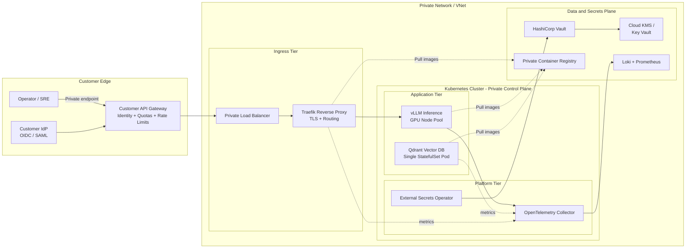

# llm-onprem-deployment-kit

## Live Demo

- [Open the public GitHub Pages demo](https://kim3310.github.io/llm-onprem-deployment-kit/)
- Scope: credential-free, synthetic-data demo for deployment reviewers and evaluators.

> A customer-owned deployment baseline for evaluating private, hybrid, or air-gapped LLM infrastructure. It is designed for a bounded readiness sprint and must be adapted and validated before production use.

[](https://github.com/KIM3310/llm-onprem-deployment-kit/actions/workflows/terraform-validate.yml)
[](https://github.com/KIM3310/llm-onprem-deployment-kit/actions/workflows/helm-lint.yml)
[](https://github.com/KIM3310/llm-onprem-deployment-kit/actions/workflows/shellcheck.yml)
[](./LICENSE)
[](https://www.terraform.io/)
[](https://kubernetes.io/)
[](https://helm.sh/)

---

## System Overview

A private/hybrid LLM deployment kit for organizations that cannot send sensitive workloads to uncontrolled hosted endpoints.

| Area | Details |
|---|---|
| Users | Regulated enterprises, internal AI platform teams, security architects, and infrastructure operators. |
| Technical path | Validate the demo, README, architecture notes, and quality gate before deeper workflow review. |
| System scope | Terraform, Helm, air-gapped notes, compliance runbooks, model-routing boundaries, and infrastructure controls. |
| Operating boundary | Customer owns the cloud account, cluster, registry, KMS, secrets, data, and logs. The chart supplies API-key protection and a reverse-proxy path, not end-user identity, tenant authorization, rate limiting, clustered vector state, or production evidence. |
| Evaluation path | Inspect the infra modules, run validation commands where available, and review the operating notes. |

## Evaluation Path

- **Start here:** Read the reference architecture, then jump to compliance mappings and airgap runbooks.
- **Local demo:** Use dry-run infrastructure validation rather than deploying by default.
- **Checks:** Run `make validate`; targeted checks are `make tf-validate`, `make helm-lint`, and `make shell-lint`.

## Local Validation Tiers

```bash
make verify    # repository surface + architecture blueprint; requires Python only
make validate  # Terraform, Helm, and ShellCheck validation; requires the infra toolchain
```

If Terraform, Helm, or ShellCheck are installed outside `PATH`, pass explicit paths, for example:

```bash
make TERRAFORM=/path/to/terraform HELM=/path/to/helm SHELLCHECK=/path/to/shellcheck validate
```

## Service Launch Playbook

- [Service launch playbook](docs/service-launch-playbook.md) maps the repository to its product scope, operating gates, operating boundaries, and risk controls.

## Architecture Notes

- [Architecture guide](docs/architecture-evidence-map.md) summarizes the system scope, first files to inspect, runtime commands, and known boundaries.
- [Quality notes](docs/quality-gate.md) lists the local checks, CI surface, and release expectations for this repository.
- [Enterprise readiness notes](docs/enterprise-readiness.md) outlines security, data, operations, integration, and handoff expectations.

## Table of Contents

1. [Why this exists](#why-this-exists)
2. [What you get](#what-you-get)
3. [Reference Architecture](#reference-architecture)
4. [Quick Start](#quick-start)
5. [Compliance Mappings](#compliance-mappings)
6. [Runbooks](#runbooks)
7. [Choosing a Cloud](#choosing-a-cloud)
8. [Security Model](#security-model)
9. [Extending](#extending)
10. [Related Projects](#related-projects)
11. [License](#license)

---

## Why this exists

Shipping large language model (LLM) applications to regulated customers is not a model problem. It is an *infrastructure* problem.

By the time a customer has decided to buy, their deployment team is asking questions that have little to do with tokens per second:

- "Can we run this inside our existing VNet with no egress to the public internet?"
- "Where does the encryption key live and who rotates it?"
- "How do we mirror the container images into our private registry?"
- "What does your disaster recovery look like, and can you show us an actual runbook?"
- "Does this map to our SOC 2 and ISO 27001 controls?"

`llm-onprem-deployment-kit` packages infrastructure-as-code, a Helm baseline, runbooks, and control-mapping aids for a customer-owned readiness sprint. It shortens architecture review and pilot setup; it does not certify that a rendered template is a running, auditable production system.

**Target audience:**

- Enterprise infrastructure teams responsible for deploying third-party AI workloads in regulated environments (financial services, healthcare, public sector, defense, energy).
- Forward deployed engineering teams at AI-native vendors who need a consistent deployment story across dozens of customer environments.
- Security and compliance approvers who need to map a proposed deployment to existing control frameworks before granting change-management approval.

If the question is "how fast can I get a demo LLM running on my laptop," this is not the right repository. If the question is "what must we validate before a private LLM pilot can run inside the customer's account," this is the intended starting point.

---

## What you get

- **Terraform across three clouds** - Reviewable Azure AKS, AWS EKS, and GCP GKE module starters with private-cluster, GPU-pool, private-endpoint, and optional customer-managed encryption controls.
- **A guarded Helm baseline** - `llm-stack` connects Traefik to API-key-protected vLLM, keeps Qdrant single-node until distributed consensus is explicitly designed, and optionally renders OpenTelemetry and External Secrets resources.
- **Airgap runbooks and tooling** - `scripts/airgap-mirror.sh` enumerates every container image the kit ships with their pinned digests and mirrors them into a customer-controlled registry. A step-by-step runbook walks through the procedure.
- **Compliance mappings** - Explicit control-by-control mapping for SOC 2 Type II and ISO 27001:2022 Annex A, plus an "airgap requirements" summary that most procurement teams can consume directly.
- **Incident response playbook** - Severity levels, paging thresholds, customer handoff pattern, and a diagnostic-bundle collection script that produces the artifacts support actually needs.
- **Architecture Decision Records** - Documented rationale for every load-bearing choice (vLLM vs TGI, Qdrant vs Weaviate, K8s vs ECS, secrets model, airgap image strategy), so downstream teams can challenge or extend decisions without reverse-engineering them.
- **Validation surface** - Terraform validation, Helm lint/render/schema checks, runtime-contract checks, and ShellCheck. Passing CI proves those repository checks only.

---

## Reference Architecture


```mermaid
flowchart LR
    subgraph CustomerEdge[Customer Edge]
        IdP[Customer IdP<br/>OIDC / SAML]
        Access[Customer API Gateway<br/>Identity + Quotas + Rate Limits]
        OpsUser[Operator / SRE]
    end

    subgraph PrivateNetwork[Private Network / VNet]
        subgraph IngressTier[Ingress Tier]
            PLB[Private Load Balancer]
            TRAEFIK[Traefik Reverse Proxy<br/>TLS + Routing]
        end

        subgraph K8sCluster[Kubernetes Cluster - Private Control Plane]
            subgraph AppTier[Application Tier]
                VLLM[vLLM Inference<br/>GPU Node Pool]
                QDRANT[Qdrant Vector DB<br/>Single StatefulSet Pod]
            end
            subgraph PlatformTier[Platform Tier]
                OTEL[OpenTelemetry Collector]
                ESO[External Secrets Operator]
            end
        end

        subgraph DataPlane[Data and Secrets Plane]
            KMS[Cloud KMS /<br/>Key Vault]
            VAULT[HashiCorp Vault]
            REGISTRY[Private Container Registry]
            LOG[Loki + Prometheus]
        end
    end

    OpsUser -->|Private endpoint| Access
    IdP --> Access
    Access --> PLB
    PLB --> TRAEFIK
    TRAEFIK --> VLLM
    VLLM --> OTEL
    QDRANT -. metrics .-> OTEL
    TRAEFIK -. metrics .-> OTEL
    OTEL --> LOG
    ESO --> VAULT
    VAULT --> KMS
    VLLM -.->|Pull images| REGISTRY
    QDRANT -.->|Pull images| REGISTRY
    TRAEFIK -.->|Pull images| REGISTRY
```

Notable properties of this architecture:

- **Private intent, customer verification.** Terraform and service annotations request private surfaces, but the customer must verify routes, DNS, firewall policy, and provider-specific load-balancer behavior.
- **Customer-owned keys.** KMS / Key Vault / Cloud KMS options keep key administration in the customer account; the sprint records who can use and rotate each key.
- **Narrow built-in auth.** vLLM validates one customer-owned API key. End-user identity, tenant policy, quotas, and rate limiting remain customer gateway responsibilities.
- **Observable components, not audit completeness.** The chart configures metric scraping and collector exporters. Per-request application audit, immutable retention, alerts, and evidence collection require customer integration and acceptance testing.

For the long form, see [`docs/architecture.md`](./docs/architecture.md).

---

## Quick Start

The quick start assumes (a) a workstation with `terraform`, `helm`, `kubectl`, and the cloud CLI of your choice; (b) permissions to create a VPC/VNet, a Kubernetes cluster, and a KMS key in the target subscription/account/project; and (c) a private container registry that the cluster can pull from.

For a full airgapped install with image mirroring, see [`docs/runbooks/initial-deploy.md`](./docs/runbooks/initial-deploy.md).

### 1. Pick a cloud and provision infrastructure

```bash
# Azure example
cd terraform/modules/azure-aks/examples/basic
terraform init
terraform plan  -out=tfplan -var-file=../../../../../examples/quickstart-azure/terraform.tfvars
terraform apply tfplan
```

Equivalent commands exist under `terraform/modules/aws-eks/examples/basic` and `terraform/modules/gcp-gke/examples/basic`.

### 2. Mirror container images (airgapped environments only)

```bash
export TARGET_REGISTRY=registry.customer.internal/llm-stack
scripts/airgap-mirror.sh --target "$TARGET_REGISTRY" --dry-run
scripts/airgap-mirror.sh --target "$TARGET_REGISTRY"
```

### 3. Create customer-owned pilot secrets

The baseline fails closed if its API-key or TLS secret is absent. For an evaluation cluster, create them directly; a customer pilot should use the approved secret manager and `ExternalSecret` path.

```bash
kubectl create namespace llm-stack
kubectl -n llm-stack create secret generic llm-stack-inference-api-key \
  --from-literal=api-key="$(openssl rand -hex 32)"
openssl req -x509 -newkey rsa:3072 -nodes -days 30 \
  -subj '/CN=llm.internal.example.com' \
  -keyout /tmp/llm-stack.key -out /tmp/llm-stack.crt
kubectl -n llm-stack create secret tls llm-stack-tls \
  --key /tmp/llm-stack.key --cert /tmp/llm-stack.crt
rm -f /tmp/llm-stack.key /tmp/llm-stack.crt
```

### 4. Install the llm-stack Helm chart

```bash
helm upgrade --install llm-stack ./helm/llm-stack \
  --namespace llm-stack \
  --values ./helm/llm-stack/values.yaml \
  --atomic --timeout 10m
```

`values-airgap.yaml` is an overlay, not a turnkey install. It requires mirrored images and model weights, an approved `ClusterSecretStore`, customer observability endpoints, TLS material, network sources, storage, and an acceptance plan.

### 5. Verify

```bash
make status
scripts/smoke-test.sh --namespace llm-stack --release llm-stack
```

The smoke test checks the routed vLLM health path, sends an API-key-protected inference request, and checks the single Qdrant endpoint. It does not prove identity integration, quotas, rate limiting, high availability, backup recovery, immutable audit, or an SLO.

---

## Compliance Mappings

This kit is designed to produce evidence that maps directly to common enterprise control frameworks. Full mappings live under [`docs/compliance/`](./docs/compliance/).

| Framework | Scope | Mapping Document |
|-----------|-------|------------------|
| SOC 2 Type II | Trust Services Criteria (Security, Availability, Confidentiality) | [`soc2-type2-mapping.md`](./docs/compliance/soc2-type2-mapping.md) |
| ISO 27001:2022 | Annex A controls applicable to cloud-hosted AI workloads | [`iso27001-mapping.md`](./docs/compliance/iso27001-mapping.md) |
| Customer airgap | Common procurement questionnaire items for airgapped and sovereign deployments | [`airgap-requirements.md`](./docs/compliance/airgap-requirements.md) |

At-a-glance control summary:

| Control theme | SOC 2 TSC | ISO 27001 Annex A | This kit provides |
|---------------|-----------|-------------------|-------------------|
| Logical access | CC6.1, CC6.2, CC6.3 | A.5.15, A.5.16, A.8.2 | vLLM API-key baseline plus customer-owned identity and gateway acceptance work |
| Encryption at rest | CC6.7 | A.8.24 | Optional CMK/IaC controls; effective encryption must be evidenced in the customer account |
| Encryption in transit | CC6.7 | A.8.24 | TLS at Traefik; east-west mTLS is not included |
| Change management | CC8.1 | A.8.32 | Terraform + Helm + GitHub Actions CI |
| Monitoring | CC7.1, CC7.2 | A.8.15, A.8.16 | OTel collector configuration and scrape surfaces; customer alerts and retention required |
| Incident response | CC7.4, CC7.5 | A.5.24, A.5.26 | [`incident-response.md`](./docs/runbooks/incident-response.md), diag bundle |
| Availability | A1.1, A1.2 | A.8.14 | HPA/PDB and multi-zone infrastructure options; Qdrant remains single-node and no HA claim is made |

---

## Runbooks

Each runbook is written to be executable by an on-call engineer with working `kubectl`/`cloud CLI` access and no prior context.

| Runbook | Purpose | When to use |
|---------|---------|-------------|
| [`initial-deploy.md`](./docs/runbooks/initial-deploy.md) | End-to-end day-1 deployment | First install or re-install into a new environment |
| [`airgap-image-mirror.md`](./docs/runbooks/airgap-image-mirror.md) | Mirror container images to a private registry | Any airgapped or sovereign install |
| [`rotate-secrets.md`](./docs/runbooks/rotate-secrets.md) | Rotate JWT signing keys, Vault roots, API keys | Scheduled rotation or after suspected compromise |
| [`upgrade-model.md`](./docs/runbooks/upgrade-model.md) | Upgrade the inference model with zero downtime | Model version bump |
| [`incident-response.md`](./docs/runbooks/incident-response.md) | SEV levels, paging, customer handoff | Any production incident |
| [`disaster-recovery.md`](./docs/runbooks/disaster-recovery.md) | Restore from backups, cross-region failover | Loss of a region / cluster |

---

## Choosing a Cloud

All three Terraform modules are feature-compatible but differ in capability, region availability, and cost. Use the decision matrix below to pick; see [`docs/choosing-a-cloud.md`](./docs/choosing-a-cloud.md) for the full write-up.

| Factor | Azure AKS | AWS EKS | GCP GKE |
|--------|-----------|---------|---------|
| GPU availability in APAC | Strong (NC A100/ND H100 in East/Southeast Asia) | Strong (p4d/p5 in Seoul, Tokyo, Sydney) | Moderate (A100 in Tokyo; regional variance) |
| Private control plane | Yes (Private Cluster) | Yes (endpointPrivateAccess) | Yes (private-endpoint master) |
| Customer-managed keys | Key Vault + HSM | KMS + CloudHSM | Cloud KMS + HSM |
| Private registry | ACR with Private Endpoint | ECR with VPC Endpoint | Artifact Registry with PSC |
| Typical enterprise fit | Microsoft-aligned regulated industries | AWS-first SaaS customers | Google-aligned data/AI customers |
| Module location | [`terraform/modules/azure-aks`](./terraform/modules/azure-aks) | [`terraform/modules/aws-eks`](./terraform/modules/aws-eks) | [`terraform/modules/gcp-gke`](./terraform/modules/gcp-gke) |

If the customer is truly multi-cloud, the `terraform/examples/airgapped-enterprise/main.tf` example composes all three modules behind a common output contract.

---

## Security Model

The full threat model is in [`docs/security-model.md`](./docs/security-model.md). The short version:

- **Trust boundaries.** The customer owns the IdP, cloud account, cluster, registry, KMS, secrets, model weights, prompts, vector data, and logs. Vendor access, when needed, is time-bounded and customer-approved.
- **Networking.** Default values keep `NetworkPolicy` off because model download may need egress. The air-gap overlay enables default-deny and requires approved ingress namespaces or CIDRs. Effective isolation must be tested in-cluster.
- **Secrets.** The baseline references an existing Kubernetes Secret. Optional ESO resources copy remote values into Kubernetes Secrets, which may be stored in etcd; customer encryption-at-rest, RBAC, rotation, and audit controls determine the real posture.
- **Authorization.** vLLM API-key validation is the only built-in request control. Customer identity, tenant authorization, quotas, tool policy, and rate limits are excluded from the chart.
- **Observability.** Metric and collector configuration are provided. Complete request audit, immutable storage, alerting, redaction, retention, and evidence of control operation are customer acceptance items.

---

## Extending

### Add a fourth cloud

1. Copy `terraform/modules/azure-aks` to `terraform/modules/<cloud>-<service>`.
2. Replace the provider block and cluster resource; keep the variable and output contracts identical.
3. Add a `workflows/terraform-validate.yml` matrix entry for the new module path.
4. Add an entry to [`docs/choosing-a-cloud.md`](./docs/choosing-a-cloud.md).

The Helm chart is cloud-agnostic; no changes are required there.

### Swap the inference engine

`values.yaml` has a top-level `inference:` block and the templates reference only common fields (`image`, `args`, `env`, `ports`, `resources`). To swap vLLM for TGI or llama.cpp:

1. Override `inference.image.repository` and `inference.args`.
2. Adjust `inference.service.ports` if the engine uses a different OpenAI-compatible port.
3. Regenerate the HPA custom metric if the engine exposes different GPU utilization metrics.

See [`docs/adr/002-vllm-vs-tgi-selection.md`](./docs/adr/002-vllm-vs-tgi-selection.md) for the trade-offs.

### Replace the vector database

`values.yaml` has a top-level `vectorDb:` block, but the current templates implement Qdrant only. The validation gate rejects more than one replica because distributed consensus is not configured. Replacing the engine or enabling clustered Qdrant requires new templates, migration/backup tests, and a customer-specific acceptance plan. See [`docs/adr/003-vector-db-selection.md`](./docs/adr/003-vector-db-selection.md).

---

## Related Projects

This kit is part of a wider stack for shipping LLM applications into enterprise environments:

- **[enterprise-llm-adoption-kit](https://github.com/KIM3310/enterprise-llm-adoption-kit)** - The application layer this kit is designed to deploy. RAG pipeline, RBAC, audit logs.
- **[stage-pilot](https://github.com/KIM3310/stage-pilot)** - Tool-calling reliability runtime. Complements the inference service by making tool use deterministic.
- **[AegisOps](https://github.com/KIM3310/AegisOps)** - Multimodal incident analysis with operator handoff; referenced by [`docs/runbooks/incident-response.md`](./docs/runbooks/incident-response.md).
- **[Nexus-Hive](https://github.com/KIM3310/Nexus-Hive)** - Multi-agent natural-language-to-SQL copilot. A downstream consumer of the inference API.

---

## License

[MIT](./LICENSE) (c) 2026 Doeon Kim.

This repository bundles references to third-party container images (vLLM, Qdrant, Traefik, OpenTelemetry Collector, and External Secrets Operator) which retain their own upstream licenses. See [`docs/runbooks/airgap-image-mirror.md`](./docs/runbooks/airgap-image-mirror.md) for the full image inventory.

## Cloud + AI Architecture

- [Cloud + AI architecture blueprint](docs/cloud-ai-architecture.md)
- [Machine-readable architecture manifest](docs/architecture/blueprint.json)
- Validation command: `python3 scripts/validate_architecture_blueprint.py`

## Enterprise Productization

- [Product operating model](docs/product-operating-model.md) defines the product scope, trust boundary, operating checks, and service path for this repository.

## System Architecture

- [System architecture](docs/system-architecture.md) maps the runtime boundary, data/control flow, cloud or local deployment surface, and operating assumptions for this repository.

## Service Architecture

- [Service architecture](docs/service-architecture.md) defines the cloud resources, account information, cost controls, and production guardrails needed to turn this repo into a scoped service without publishing public financial assumptions.

<!-- search-growth-readme:start -->

## Search And Service Surface

- Public entry: free reference architecture and Helm/Terraform starter kit
- Paid boundary: paid private deployment support, hardened values pack, and upgrade runbook subscription
- Canonical URL: https://kim3310.github.io/llm-onprem-deployment-kit/
- Lead capture: https://kim3310-doeon-kim-portfolio.pages.dev/?offer=llm-onprem-deployment-kit&inquiry=private-ai-readiness-sprint#private-inquiry
- Commercial route: https://kim3310-doeon-kim-portfolio.pages.dev/?offer=llm-onprem-deployment-kit#service-offers
- Machine-readable offer: [docs/service-offer.json](docs/service-offer.json)
- Search growth implementation: [docs/search-growth-implementation.md](docs/search-growth-implementation.md)
- Revenue architecture: [docs/revenue-architecture.md](docs/revenue-architecture.md)

<!-- search-growth-readme:end -->
