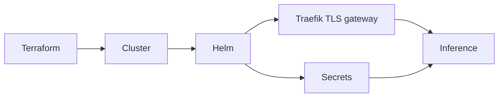

# LLM On-Prem Deployment Kit

Terraform modules and a Helm stack for private LLM infrastructure, with explicit deployment boundaries, secret wiring, TLS routing and repeatable validation.

**Infrastructure as code · Kubernetes · deployment verification**

[Preview](https://kim3310.github.io/llm-onprem-deployment-kit/) · [Verification and design](docs/VERIFICATION.md) · [CI](https://github.com/KIM3310/llm-onprem-deployment-kit/actions) · [Detailed setup](REFERENCE.md)


```mermaid
flowchart LR
    Terraform --> Cluster
    Cluster --> Helm
    Helm --> Gateway[Traefik TLS gateway]
    Gateway --> Inference
    Helm --> Secrets
    Secrets --> Inference
```

## Inspect the implementation

| Source | What it demonstrates |
|---|---|
| [terraform/modules](terraform/modules) | AWS, Azure and GCP infrastructure modules |
| [helm/llm-stack](helm/llm-stack) | Inference, gateway, Qdrant and observability chart |
| [helm/llm-stack/templates/gateway-dynamic-configmap.yaml](helm/llm-stack/templates/gateway-dynamic-configmap.yaml) | TLS routing and HTTP-to-HTTPS redirect |
| [tests/cluster-smoke.sh](tests/cluster-smoke.sh) | Actual kind deployment with authenticated routing and pod recovery |
| [.github/workflows/cluster-smoke.yml](.github/workflows/cluster-smoke.yml) | Repeatable Kubernetes smoke and downloadable result |

## Run it

```sh
make verify
make validate
# Disposable Docker/kind environment only:
kind create cluster --name portfolio-smoke
KIND_CLUSTER_NAME=portfolio-smoke bash tests/cluster-smoke.sh
```

## Evidence

Terraform formatting, initialization and validation pass in all 8 module/example directories. Default, development and airgap Helm lint/render contracts and ShellCheck pass. The Kubernetes workflow deploys the chart with real Traefik/TLS and an explicitly synthetic inference protocol fixture; its artifact lists the checks performed.

## Scope

No GPU inference, model-quality benchmark, customer cloud provisioning, network-policy enforcement, Qdrant persistence or offline airgap installation is claimed. The kind fixture proves chart/process/network wiring; production image/model compatibility still requires GPU deployment validation.

## Further reading

[Architecture](docs/cloud-ai-architecture.md) · [Architecture manifest](docs/architecture/blueprint.json) · [Architecture validator](scripts/validate_architecture_blueprint.py) · [Original reference](REFERENCE.md)
