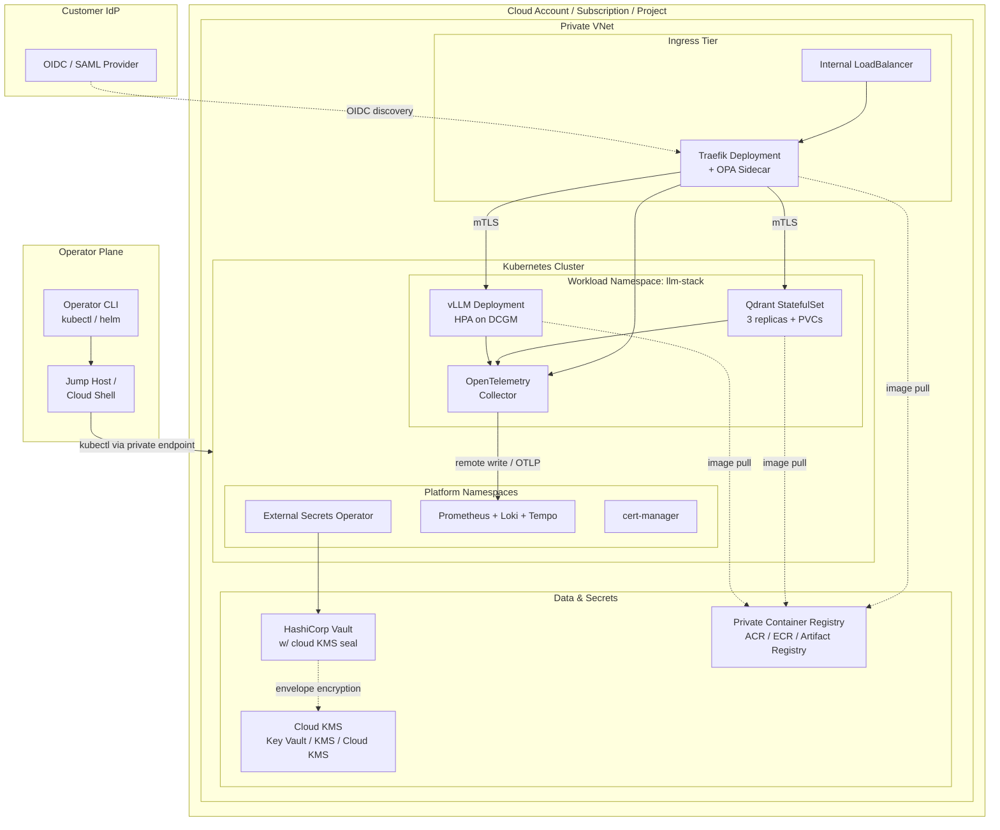

# Reference Architecture

This document is the long-form companion to the Reference Architecture section of the root [README](../README.md). It describes the intended topology, the trust boundaries, the data flows, and the default scaling envelope.

## Topology

## Layers

### L1 - Network

- **No public ingress.** The API server endpoint is private; the application load balancer is internal. Customers expose the service through their own reverse proxy or API management layer.
- **NAT only for bootstrap.** Production nodes do not require public egress once images are mirrored to the in-VNet registry.
- **VPC/VNet peering** is used where the cluster needs to reach customer-managed data stores (Vault, observability).

### L2 - Kubernetes

- **Private control plane.** AKS `private_cluster_enabled=true`, EKS `endpoint_public_access=false`, GKE `enable_private_endpoint=true`.
- **Azure RBAC / EKS access entries / Workload Identity** for operator access. Local accounts (`--admin`) disabled on AKS.
- **Network policy default-deny** at the release namespace level.
- **Pod security context:** `runAsNonRoot`, `readOnlyRootFilesystem`, `seccompProfile=RuntimeDefault`, drop all capabilities.
- **Node pools:**
  - System pool for platform workloads (3 nodes, m6i/D-series/n2).
  - GPU pool tainted `nvidia.com/gpu=true:NoSchedule`. Only vLLM pods tolerate it.

### L3 - Application

- **Inference** runs vLLM with the OpenAI-compatible API, tuned with `--max-model-len`, `--disable-log-requests`. HPA scales on GPU utilization via the DCGM exporter as a custom metric.
- **Vector DB** is Qdrant as a 3-replica StatefulSet. Pod anti-affinity on `topology.kubernetes.io/zone` keeps replicas on separate zones. Data is persisted on encrypted PVCs.
- **Gateway** is Traefik with an OPA sidecar that evaluates policy for every request. OPA decisions are observable via the OTel collector.
- **Observability** is a single OTel collector Deployment that receives OTLP from the app, scrapes Prometheus endpoints from pods, and ships to customer-provided Prometheus / Loki / Tempo backends.

### L4 - Data and secrets

- **Secrets** live in HashiCorp Vault (customer-deployed), sealed by the cloud KMS. External Secrets Operator reconciles `ExternalSecret` resources into native Kubernetes Secrets. Nothing lives in Git.
- **Container images** are pulled from a private registry (ACR / ECR / Artifact Registry) populated by `scripts/airgap-mirror.sh`.
- **Model weights** are either baked into an image at mirror time or staged onto a dedicated read-only PVC.

## Scaling envelope

The reference architecture is sized for steady-state load of approx 50 RPS of chat completions on a 7-8B-class model.

| Component | Replicas | CPU (req/limit) | Memory (req/limit) | GPU |
|-----------|---------:|-----------------|--------------------|-----|
| vLLM | 2-8 (HPA) | 4 / 8 | 60Gi / 80Gi | 1x A100 per replica |
| Qdrant | 3 | 2 / 4 | 4Gi / 8Gi | - |
| Traefik | 2 | 0.2 / 0.5 | 256Mi / 512Mi | - |
| OPA (sidecar) | - | 0.1 / 0.25 | 128Mi / 256Mi | - |
| OTel Collector | 2 | 0.2 / 0.5 | 256Mi / 512Mi | - |

Scale-up latency: approximately 8-12 minutes from HPA trigger to a new vLLM pod being Ready, dominated by GPU node provisioning (4-7 minutes) and model load time (2-5 minutes).

## Data flow: single inference request

1. Client hits the internal LB at `https://llm.internal.example.com`.
2. Traefik terminates TLS (cert from cert-manager), forwards to the OPA sidecar for authorization using the Envoy ext_authz pattern.
3. OPA evaluates the policy bundle with the request (JWT, path, method). Decision is logged via OTel.
4. On allow, Traefik routes to `svc/llm-stack-inference`. Envoy-style retries (3x on 5xx) are in effect.
5. vLLM serves the completion. Request metadata (no content) is emitted via OTel to the collector.
6. OTel collector fans out: metrics to Prometheus, logs to Loki, traces to Tempo.

## Trust boundaries

| Boundary | Crossed by | Mechanism |
|----------|------------|-----------|
| Customer -> Cluster | HTTPS requests | TLS to the internal LB; OPA authorization |
| Cluster -> KMS | Data-at-rest | Cloud IAM identity of the cluster (managed identity / IRSA / Workload Identity) |
| Cluster -> Vault | Secret access | Kubernetes auth method on Vault, per-service account |
| Operator -> Cluster | kubectl | Cloud IAM + Azure AD / IAM / Google IAM; API server private endpoint |
| Inference pod -> Model registry | Image pull | Cluster node identity + immutable tag |

See [`security-model.md`](./security-model.md) for the threat model.
