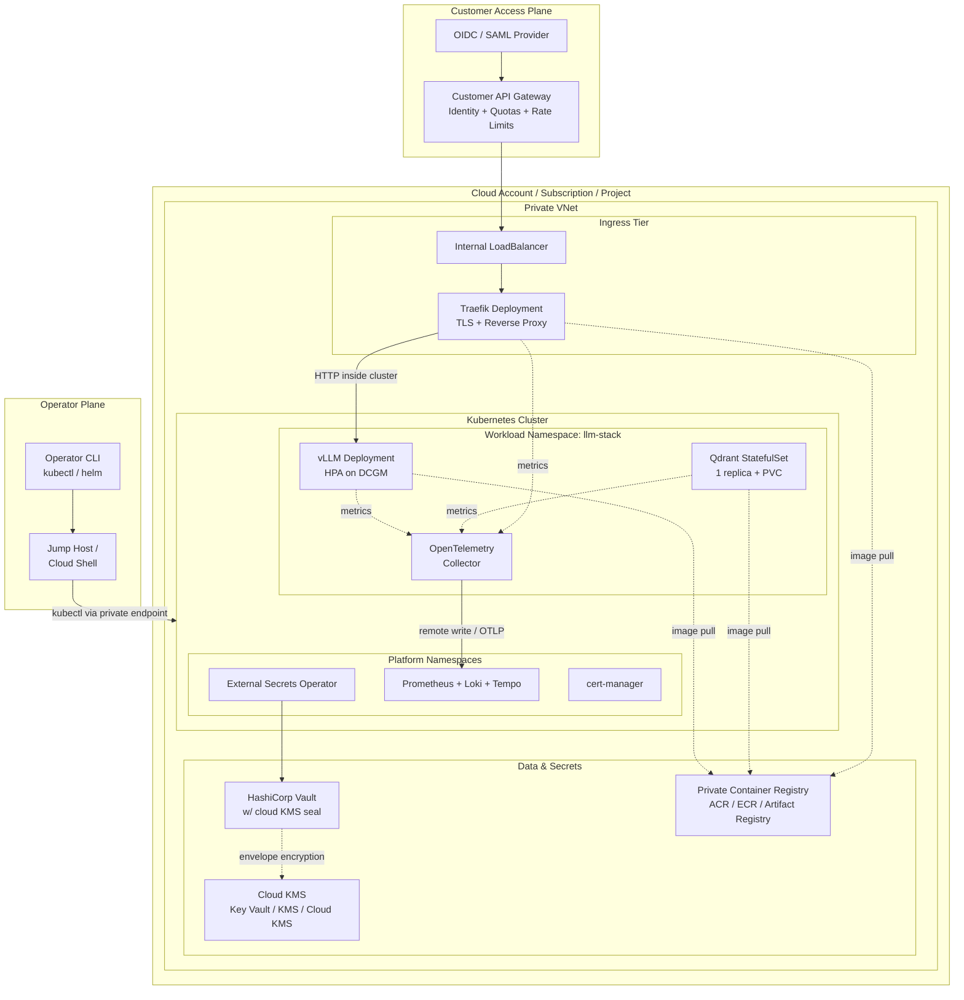

# Reference Architecture

This document is the long-form companion to the Reference Architecture section of the root [README](../README.md). It separates the chart's current behavior from controls that a customer must add and verify during a readiness sprint.

## Topology

```mermaid
flowchart TB
    subgraph CustomerAccess[Customer Access Plane]
        OIDC[OIDC / SAML Provider]
        APIGW[Customer API Gateway<br/>Identity + Quotas + Rate Limits]
    end

    subgraph Operator[Operator Plane]
        CLI[Operator CLI<br/>kubectl / helm]
        Bastion[Jump Host /<br/>Cloud Shell]
    end

    subgraph CloudAcct[Cloud Account / Subscription / Project]
        subgraph VNet[Private VNet]
            subgraph Ingress[Ingress Tier]
                ILB[Internal LoadBalancer]
                GW[Traefik Deployment<br/>TLS + Reverse Proxy]
            end

            subgraph K8s[Kubernetes Cluster]
                direction TB
                subgraph Apps[Workload Namespace: llm-stack]
                    VLLM[vLLM Deployment<br/>HPA on DCGM]
                    QDRANT[Qdrant StatefulSet<br/>1 replica + PVC]
                    OTEL[OpenTelemetry<br/>Collector]
                end
                subgraph Plat[Platform Namespaces]
                    ESO[External Secrets Operator]
                    PROM[Prometheus + Loki + Tempo]
                    CERT[cert-manager]
                end
            end

            subgraph Data[Data & Secrets]
                VAULT[HashiCorp Vault<br/>w/ cloud KMS seal]
                REG[Private Container Registry<br/>ACR / ECR / Artifact Registry]
                KMS[Cloud KMS<br/>Key Vault / KMS / Cloud KMS]
            end
        end
    end

    OIDC --> APIGW
    CLI --> Bastion
    Bastion -->|kubectl via private endpoint| K8s
    APIGW --> ILB
    ILB --> GW
    GW -->|HTTP inside cluster| VLLM
    VLLM -. metrics .-> OTEL
    QDRANT -. metrics .-> OTEL
    GW -. metrics .-> OTEL
    ESO --> VAULT
    VAULT -.->|envelope encryption| KMS
    VLLM -.->|image pull| REG
    QDRANT -.->|image pull| REG
    GW -.->|image pull| REG
    OTEL -->|remote write / OTLP| PROM
```

## Layers

### L1 - Network

- **Private ingress is an acceptance claim, not a render claim.** Modules and service annotations request private surfaces. The customer must verify provider routing, DNS, firewall, source ranges, and the absence of public paths.
- **NAT only for bootstrap.** Production nodes do not require public egress once images are mirrored to the in-VNet registry.
- **VPC/VNet peering** is used where the cluster needs to reach customer-managed data stores (Vault, observability).

### L2 - Kubernetes

- **Private control plane.** AKS `private_cluster_enabled=true`, EKS `endpoint_public_access=false`, GKE `enable_private_endpoint=true`.
- **Azure RBAC / EKS access entries / Workload Identity** for operator access. Local accounts (`--admin`) disabled on AKS.
- **Network policy** is disabled in the baseline because model download may need egress. The air-gap overlay enables default-deny and requires approved gateway ingress sources.
- **Pod security context:** `runAsNonRoot`, `readOnlyRootFilesystem`, `seccompProfile=RuntimeDefault`, drop all capabilities.
- **Node pools:**
  - System pool for platform workloads (3 nodes, m6i/D-series/n2).
  - GPU pool tainted `nvidia.com/gpu=true:NoSchedule`. Only vLLM pods tolerate it.

### L3 - Application

- **Inference** runs vLLM with the OpenAI-compatible API, tuned with `--max-model-len`, `--disable-log-requests`. HPA scales on GPU utilization via the DCGM exporter as a custom metric.
- **Vector DB** is one Qdrant StatefulSet pod with one PVC. The chart rejects multiple replicas because it does not configure Qdrant distributed consensus.
- **Gateway** is Traefik with a file-provider route to vLLM. It terminates optional TLS and forwards the bearer value; vLLM performs the built-in API-key check.
- **Identity and policy** are customer responsibilities. The chart does not include OIDC/SAML, tenant authorization, quotas, rate limiting, tool policy, or east-west mTLS.
- **Observability** configures a collector, metric scraping, and customer exporter targets. It does not make every request emit traces/logs or prove immutable audit retention.

### L4 - Data and secrets

- **Secrets** are customer-owned. The baseline references an existing Kubernetes Secret; the optional air-gap overlay renders `ExternalSecret` resources against a customer-created store. ESO still creates native Kubernetes Secrets, so etcd encryption, RBAC, rotation, and audit must be verified.
- **Container images** are pulled from a private registry (ACR / ECR / Artifact Registry) populated by `scripts/airgap-mirror.sh`.
- **Model weights** are either baked into an image at mirror time or staged onto a dedicated read-only PVC.

## Configured Envelope

These are chart settings, not benchmark or capacity guarantees. GPU type, model, quantization, context length, batching, prompt shape, storage, and provider quotas materially change results.

| Component | Replicas | CPU (req/limit) | Memory (req/limit) | GPU |
|-----------|---------:|-----------------|--------------------|-----|
| vLLM | 2-8 (HPA) | 4 / 8 | 60Gi / 80Gi | 1x A100 per replica |
| Qdrant | 1 | 2 / 4 | 4Gi / 8Gi | - |
| Traefik | 2 | 0.2 / 0.5 | 256Mi / 512Mi | - |
| OTel Collector | 2 | 0.2 / 0.5 | 256Mi / 512Mi | - |

HPA output requires a functioning external metrics adapter and DCGM metric pipeline. A readiness sprint must measure actual cold start, throughput, latency, saturation, and scale behavior in the selected customer region.

## Data flow: single inference request

1. Client hits the internal LB at `https://llm.internal.example.com`.
2. A customer API gateway should apply identity, tenant policy, quotas, and rate limits before traffic reaches the internal load balancer.
3. Traefik terminates configured TLS and routes to `svc/llm-stack-inference`.
4. vLLM compares the bearer value to the customer-owned API key and serves the completion when valid.
5. Prometheus scraping and any application OTLP emission feed the collector. Complete request audit requires separate application and retention integration.

## Trust boundaries

| Boundary | Crossed by | Mechanism |
|----------|------------|-----------|
| Customer -> Cluster | HTTPS requests | Customer gateway policy, internal routing, Traefik TLS, and vLLM API-key check |
| Cluster -> KMS | Data-at-rest | Cloud IAM identity of the cluster (managed identity / IRSA / Workload Identity) |
| Cluster -> Vault | Secret access | Kubernetes auth method on Vault, per-service account |
| Operator -> Cluster | kubectl | Cloud IAM + Azure AD / IAM / Google IAM; API server private endpoint |
| Inference pod -> Model registry | Image pull | Cluster node identity + immutable tag |

See [`security-model.md`](./security-model.md) for the threat model.
